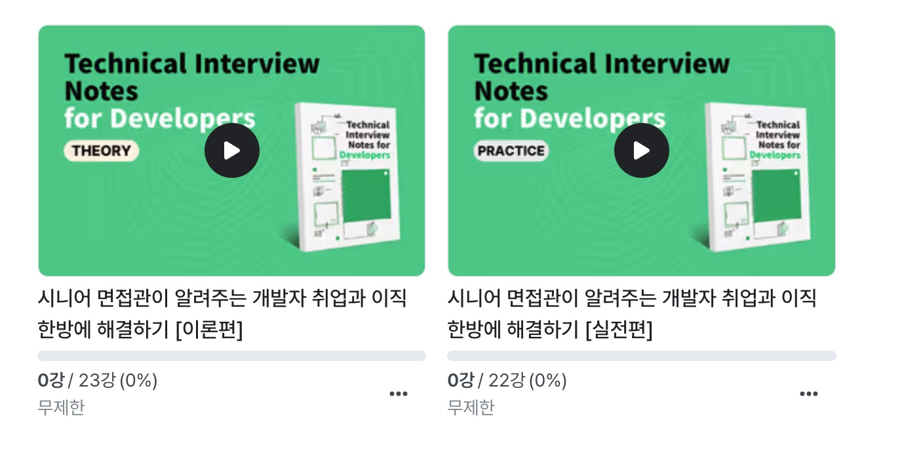

# Java Design Pattern Guide 

> 본 내용은 한빛미디어에서 출간한 책(개발자 기술 면접 노트)의 일부 내용을 보강하기 위해서 만든 Design Pattern 가이드 예제입니다.<br>
> 책의 분량상 코드나 이론등의 내용을 다 담아내지 못하였기에 본 문서로 추가적인 설명을 진행합니다.<br>
> 만약 내용에 문제가 있거나 오/탈자가 있을 경우 villainscode@gmail.com으로 메일 부탁드립니다.
>
>
> - Instagram - [https://www.instagram.com/codevillains](https://www.instagram.com/codevillains)
> - email - [villainscode@gmail.com](mailto:villainscode@gmail.com)
> - Yes24 - https://www.yes24.com/Product/Goods/125554439
> - KyoboBooks - https://product.kyobobook.co.kr/detail/S000212738756

# 인프런 강의



- [시니어면접관이 알려주는 개발자 취업과 이직, 한방에 해결하기 이론편](https://www.inflearn.com/course/%EC%8B%9C%EB%8B%88%EC%96%B4-%EB%A9%B4%EC%A0%91%EA%B4%80-%EC%95%8C%EB%A0%A4%EC%A3%BC%EB%8A%94-%EC%B7%A8%EC%97%85-%EC%9D%B4%EC%A7%81-%EC%9D%B4%EB%A1%A0)
- [시니어면접관이 알려주는 개발자 취업과 이직, 한방에 해결하기 실전편](https://www.inflearn.com/course/%EC%8B%9C%EB%8B%88%EC%96%B4-%EB%A9%B4%EC%A0%91%EA%B4%80-%EC%95%8C%EB%A0%A4%EC%A3%BC%EB%8A%94-%EC%B7%A8%EC%97%85-%EC%9D%B4%EC%A7%81-%EC%8B%A4%EC%A0%84)


# 목차 
- 디자인 패턴
    - Adapter
    - Command
    - Decorator
    - Facade
    - Factory method
    - Singleton
    - Strategy
    - Template Method
<hr/>

자바의 디자인 패턴은 프로그래밍시 반복되거나 강결합된 코드들로 인한 상호 영향을 최소화 하기 위한 설계 패턴이다. 주 목적은 간결하고 유지보수 쉬운 코드를 작성한다는 것이고, 잘 설계된 디자인 패턴은 프로그램을 더욱 확장 가능하고 재사용성을 높혀 주기 때문에 주요 디자인 패턴에 대해서 공고히 이해할 필요가 있다.

여기서는 비교적 자주 쓰이는 Factory Method, Singleton 을 비롯한 Strategy, Template Method, Facade, Command 패턴에 대해서 소스코드와 함께 설명하도록 한다.

# Factory Method

---

구체적인 클래스에 의존하지 말고 추상적인 클래스에 의존한다.

객체의 생성을 하위 클래스에 위임하여 처리하도록 추상화된 메서드를 제공하는 디자인 패턴이다.  객체가 변경되더라도 사용자에게 영향을 주지 않게 하기 위함이다.

- Object 생성시 new 를 사용하여 생성할 경우 Concrete class 를 의존하여 코딩하기 때문에 결합도가 매우 높다. (수정시 의존도가 높고 유연성이 떨어짐)
    - 객체 생성에 new 키워드로 구체 클래스 B의 인스턴스를 생성했을때 B의 인스턴스가 변경되면 프로그램이 수정되어야 한다.
- Factorty Pattern을 통해 실제 사용하는 곳에서 Concrete class를 정하지 않고 Factory를 사용하여 의존성을 받도록 하여 Concrete class를 전혀 의존하지 않도록 한다 (DIP : Depencency Inversion Priciple)
    - 여러 인스턴스를 생성해야 할 경우 팩토리 메소드를 사용한다.

## Usage

---

```java
public class Car {
    public static final String SMALL_CAR = "small";
    public static final String SEDAN_CAR = "sedan";
    public static final String LUXURY_CAR = "luxury";
    
    private String productName;
    
    public Car(String name) {
        this.productName = name;
    }

    @Override
    public String toString() {
        return "Car productName = '" + productName + '\'';
    }
}
```

Car 라는 클래스를 선언하고 생성된 Car의 종류를 출력하는 간단한 프로그램이다.

이 클래스를 호출하기 위해 보통은 아래와 같은 new 연산자로 호출을 하게 된다.

```java
Car car = new Car(Car.LUXURY_CAR);
```

이런 형태로 여러 종류의 Car 를 생성하는 코드를 테스트 한다면 아래와 같을 것이다.

```java
public static void main(String[] args) {
        CarTest carTest = new CarTest();
        Car car = carTest.createCar("SEDAN");
        System.out.println(car.toString());
    }

private Car createCar(String carName) {
    Car car;

    if (carName.equalsIgnoreCase(Car.SEDAN_CAR)) {
        car = new Car(Car.SEDAN_CAR);
    } else if (carName.equalsIgnoreCase(Car.SMALL_CAR)) {
        car = new Car(Car.SMALL_CAR);
    }  else if (carName.equalsIgnoreCase(Car.LUXURY_CAR)) {
        car = new Car(Car.LUXURY_CAR);
    } else {
        car = new Car("");
    }
    return car;
}
```

createCar 에 car 의 종류가 추가 되면 로직이 계속 변경/추가 되어야 할 것이고, Car 클래스가 만약 다른 이름으로 변경 된다면 호출되는 부분 전체를 다 변경해야 한다. 이를 해소하기 위해 factory 패턴을 사용한다.

생성 될 수 있는 객체를 추상화하고, 클라이언트는 실제 인스턴스 내부를 보지 않고 팩토리가 제공하는 생성 매소드를 바라보게 변경한다.

```java
public abstract class Car {
    private CarType model;

    public Car(CarType model) {
        this.model = model;
        arrangePart();
    }

    protected void arrangePart() {
        System.out.println("Do one time processing here");
    }

    protected abstract void construct();     // 서브 클래스에서 이 메서드를 구현한다. 

}
```

```java
public enum CarType {
    SMALL, SEDAN, LUXURY
}
```

Car 클래스는 직접 생성해서 접근할 필요가 없으므로, abstract 키워드로 추상화를 통해 하위 클래스가 해야 할 작업 정도만을 정의 하도록 한다.

기존에 상수로 정의된 항목들은 enum으로 변경 하였다. (큰 차이는 없다)

기존에 Car의 종류인 if else 로 처리한 각각의 타입들은 Car를 상속 받은 각각의 클래스로 변경하였다.

```java
public class LuxuryCar extends Car {
    LuxuryCar() {
        super(CarType.LUXURY);
        construct();
    }

    @Override
    protected void construct() {
        System.out.println("Building luxury Car");
        // do something
    }
}
```

```java
public class SedanCar extends Car {
    SedanCar() {
        super(CarType.SEDAN);
        construct();
    }
    @Override
    protected void construct() {
        System.out.println("Building sedan car");
        // do something
    }
}
```

```java
public class SmallCar extends Car {
    SmallCar() {
        super(CarType.SMALL);
        construct();
    }

    @Override
    protected void construct() {
        System.out.println("Building small car");
        // do something
    }
}
```

그리고 각각의 car 를  생성하는 역할을 하는 factory 를 만들도록 한다.

```java
public class CarFactory {
    public static Car buildCar(CarType model) {
        Car car = null;
				// 실제 추가 변경 되는 부분 
        switch (model) {
            case SMALL:
                car = new SmallCar();
                break;
            case SEDAN:
                car = new SedanCar();
                break;
            case LUXURY:
                car = new LuxuryCar();
                break;
            default:
                break;
        }
        return car;
    }
}
```

실제 Car를 생성하는 부분을 CarFactory의 buildCar를 통해 처리하고 클라이언트 코드들은 CarFactory를 바라보기 때문에 내부에서 추가되는 부분에 영향을 받지 않게 된다.

```java
public class TestFactoryPattern {

    public static void main(String[] args) {
        // Car car1 = CarFactory.buildCar(CarType.SMALL);
        // Car car2 = CarFactory.buildCar(CarType.SEDAN);
        System.out.println(CarFactory.buildCar(CarType.SMALL));
        System.out.println(CarFactory.buildCar(CarType.SEDAN));
        System.out.println(CarFactory.buildCar(CarType.LUXURY));
    }
}
```

호출 영역에서 CarFactory.buildCar() 를 통해 Car 타입을 받을 수 있으며 내부로직 변경이나 생성 코드의 변경이 없어도 확장이 가능한 패턴이다.

만약 더 다양한 추상화를 통해 스포츠카 혹은 SUV 종류별로 Car 를 생성하고 싶다면 다시 CarFactory를 추상화 하는 과정을 통해 브랜드별, 종류별 Car를 생성하되 직접 호출 없이 유연하게 변경할 수 있다.

# Singleton

---

싱글톤 패턴은 해당 클래스의 인스턴스가 오직 하나만 만들어지고, 어디서든지 그 인스턴스에 접근할 수 있도록 하기 위한 패턴이다. 객체를 불필요하게 생성하는 것을 방지한다.

전역 변수를 사용하지 않아도 클래스에 대한 단일 인스턴스를 생성할 수 있으며, 이를 통해 객체간 결합도를 낮출수 있다.

공용으로 사용하는 클래스(환경 설정 클래스나 커넥션 풀 등)와 같이 프로그램의 종료 시점까지 단 하나의 인스턴스만을 생성하고 재 사용한다거나 관리할 때 유용하다.

## Usage

---

고전적인 방식의 싱글턴 구현 패턴을 살펴보자.

이 경우 멀티 스레드 환경에서 실행되었을 때 문제가 발생하는데, getInstance() 메소드가 끝나기도 전에 각각의 스레드가 접근 한 경우 유일한 인스턴스 생성을 보장할 수 없다.

```java
public class Singleton{
    private Singleton() {}
    private static SingleTon uniqueInstance;
    
    public static Singleton getInstance(){
        if(uniqueInstance == null){
		    unuqueInstance = new Singleton();
        }
        return uniqueInstance; 
	}
}
```

즉, 1번 스레드가 if (uniqueInstance == null) 구문을 체크 했을 때 null 이기 때문에 인스턴스 생성 구문으로 진입하는데 인스턴스 생성 직전 2번 스레드가 같은 구문을 진입하게 되면 1번, 2번 모두 인스턴스를 생성하게 된다.

이런 문제를 해결하기 위해 getInstance() 구문을 synchronized 구문으로 동기화 시키게 되는데 불필요한 오버헤드를 증가시킨다. 즉, getInstance() 구문의 singleton 이 null 인지 여부를 검사하기 위해 해당 메소드가 호출될 때마다 동기화가 발생한다는 것이다.

그렇지 않으면 클래스 생성과 동시에 초기화 시키는 방법도 간단하게 통용된다.

```java
public class Singleton{
    private static SingleTon uniqueInstance = new Singleton();
    private Singleton() {}

    public static Singleton getInstance(){
        return uniqueInstance;
    }
}
```

이 경우, 해당 인스턴스의 크기가 커서 초기화 하는데 시간이 걸릴 경우 각 요청마다 Blocking이 걸릴 수 있다. (static의 경우 GC에 포함이 되지 않고, instance 생성 비용이 비싸다)

이 두 부분의 문제를 해결하기 위해 Double checked locking 이라고 불리는 방법으로 늦은 초기화 (실제 사용하는 시점에 생성)와 동시에 동기화 overhead 도 없애는 방법으로 구현을 한다.

따라서 DCL을 통해 getInstance() 에서 동기화 되는 부분을 줄여 아래와 같이 생성하면 처음에만 동기화를 하고 나중에는 동기화를 하지 않아도 된다.

```java
public class Singleton{
    private volatile static SingleTon uniqueInstance;
    private Singleton() {}
    public static Singleton getInstance(){
        if(uniqueInstance == null){
            synchronized(Singleton.class){
                if(uniqueInstance == null){
                    uniqueInstance = new Singleton();
                }
            }
        }
        return uniqueInstance;
    }
}
```

위의 코드에서는 volatile 키워드를 사용하여 인스턴스가 생성되기 전에 다른 스레드에서 인스턴스 변수에 접근하는 것을 방지한다.

volatile는 변수의 변경사항이 다른 스레드에 즉시 반영되어 스레드간의 변경사항이 전파되는 역할과 원자성을 보장한다고 알려져있다.

그러나 이 코딩 방법도 객체의 메모리 영역만 할당되고 초기화가 되지 않는 케이스도 발생할 수 있다고 알려져 있기 때문에 SingletonHolder 패턴으로 해결할 수 있다.

```java
public class Singleton {
    private Singleton() {}
    private static class SingletonHolder {
        private static final Singleton INSTANCE = new Singleton();
    }

    public static Singleton getInstance() {
        return SingletonHolder.INSTANCE;
    }
}
```

이 경우

1. final은 한번 초기화 되면 값을 변경할 수 없다.
2. static은 Class가 로딩되는(즉, Access되는) 시점에 해당 객체가 JVM의 Class Area에 저장된다.
3. Inner class를 사용함으로서 SingletonHolder.INSTANCE 이 부분이 실행되기 전까지는 2.의 법칙에 의해서 Load 되지 않는다.

위와 같은 3가지 조건에 의해서 늦은 초기화, 초기화시 안정성, Thread 안정성이 확보된 케이스라고 볼 수 있다.

아래와 같이 호출할 수 있다.

```java
Singleton singleton = Singleton.getInstance();
```

Singleton 클래스의 인스턴스를 최초로 요청할 때 인스턴스가 생성된다. 이후에는 생성된 인스턴스가 반환된다.

# Strategy

---

다양한 기능을 수행하는 클래스를 작성할 때, 각각의 기능을 클래스 하나에 구현하게 되면 복잡하고 효율적이지 못하기 때문에 이를 인터페이스로 분리하고 각 기능을 나눠 구현부에서 적절히 수행하도록 하는 방식이다.

런타임중에 실행할 코드를 선택하므로써 좀 더 유연한 방식으로 클래스를 처리할 수 있다.

인터페이스로 선언한 기능을 각각의 성격에 맞게 클래스들이 구현하고 이를 클라이언트에서 호출하되, 기능 수정을 할 때 다른 클래스들에게 영향을 주지 않고 유지보수하기가 쉽다.

특징은 아래와 같다.

- 알고리즘을 쉽게 교체할 수 있다.
- 클라이언트와 알고리즘 코드를 분리할 수 있다.
- 코드 재사용성이 높다.

## Usage

---

```java
public interface CalculationStrategy {
    public int calculate(int num1, int num2);
}
```

간단한 계산기를 구현한다고 하자.

덧셈, 뺄셈, 나눗셈, 곱셈이 있을 것이고, 각각의 클래스는 주어진 역할에 따른 사칙 연산의 결과를 수행한다.

```java
// 덧셈 클래스 
public class AddOperation implements CalculationStrategy{
    @Override
    public int calculate(int num1, int num2) {
        return num1 + num2;
    }
}

// 뺄셈 클래스 
public class SubstractOperation implements CalculationStrategy{
    @Override
    public int calculate(int num1, int num2) {
        return num1 - num2;
    }
}

// 곱셈 클래스 
public class MultiplyOperation implements CalculationStrategy{
    @Override
    public int calculate(int num1, int num2) {
        return num1 * num2;
    }
}

// 나눗셈 클래스 
public class DivideOperation implements CalculationStrategy{
    @Override
    public int calculate(int num1, int num2) {
        return num1 / num2;
    }
}
```

이 로직들을 호출하는 Calculation 클래스는 수행하고자 하는 로직을 받아서 호출해주면 된다.

```java
public class Calculation {
    private CalculationStrategy strategy;

    public Calculation(CalculationStrategy strategy) {
        this.strategy = strategy;
    }

    public int executeStrategy(int num1, int num2) {
        return strategy.calculate(num1, num2);
    }
}
```

이 전략 클래스를 호출하는 클라이언트 코드는 아래와 같다.

```java
public class CalculationDemo {
    public static void main(String[] args) {
        Calculation add = new Calculation(new AddOperation());
        System.out.println("8 + 4 = " + add.executeStrategy(8, 4));

        Calculation substract = new Calculation(new SubstractOperation());
        System.out.println("8 - 4 = " + substract.executeStrategy(8, 4));

        Calculation multiply = new Calculation(new MultiplyOperation());
        System.out.println("8 * 4 = " + multiply.executeStrategy(8, 4));

        Calculation divide = new Calculation(new DivideOperation());
        System.out.println("8 / 4 = " + divide.executeStrategy(8, 4));
    }
}
```

각각의 사칙 연산을 호출 시점에 넘겨주고, strategy.calculate() 를 통해 인자로 받은 변수를 각각의 연산 클래스를 호출함으로써 의존성이 낮아지고 호출시점에 수행 클래스가 결정되는 것을 확인할 수 있을 것이다.

각 전략은 알고리즘을 구현한 개별 클래스에서 존재하므로, 삭제하거나 추가하거나 수정해도 다른 클래스들에게는 영향이 없다.

실행 결과는 아래와 같다.

```java
8 + 4 = 12
8 - 4 = 4
8 * 4 = 32
8 / 4 = 2
```

클라이언트는 구현 내부를 알 필요가 없으며, 다양한 조건식으로 분기 처리 해야 하는 코드 구문들도 전략 클래스로 변경하므로써 코드의 역할과 분리가 명확해진다는 장점이 있다.

# Template Method

---

변하는 것과 변화하지 않는 것을 분리 한다. 상위 클래스에서 전체적인 흐름과 동작을 디자인함으로써, 공통 속성에 대한 골격을 정의하고 나머지 구현은 하위 클래스로 위임 한다.

Template Method를 사용하면 서브클래스가 주요 알고리즘의 구조를 변경하지 않고 재정의할 수 있다. 주로 프레임워크에서 사용된다.

## Usage

---

공통 속성은 하위 클래스에서 재정의 하지 않도록 final 로 선언한다. 일부 메소드가 서브클래스에서 구현되므로, 기본 클래스는 Abstract Class로 선언한다.

```java
@Slf4j
public abstract class HouseTemplate { 
    private Logger logger = LoggerFactory.getLogger(this.getClass());
    //template method, final so subclasses can't override
    public final void buildHouse(){
        buildFoundation();	// 건물 기초를 짓는다.
        buildPillars();		// 건물 기둥을 짓는다.
        buildWalls();		// 건물 벽을 짓는다.
        buildWindows();		// 건물 창호를 만든다.

        logger.info("집이 완공되었다.");
    }

    //default implementation
    private void buildWindows() {
        logger.info("창호가 완성 되었다.");
    }

    //methods to be implemented by subclasses
    public abstract void buildWalls();
    public abstract void buildPillars();

    private void buildFoundation() {
        logger.info("건물의 기초 공사가 시작 되었다.");
    }
}
```

buildHouse()는 템플릿 메서드이며 여러 단계를 수행하기 위한 실행 순서를 정의 하였다.

이제 HouseTemplate 을 상속받은 나무집과 유리집의 벽과 기둥을 구현해보자.

```java
@Slf4j
public class GlassHouse extends HouseTemplate {
    private Logger logger = LoggerFactory.getLogger(this.getClass());
    @Override
    public void buildWalls() {
        logger.info("유리벽을 만들었다.");
    }

	@Override
    public void buildPillars() {
        logger.info("유리 기둥을 만들었다.");
    }
}
```

```java
@Slf4j
public class GlassHouse extends HouseTemplate {
    private Logger logger = LoggerFactory.getLogger(this.getClass());
    @Override
    public void buildWalls() {
        logger.info("나무벽을 만들었다.");
    }

    @Override
    public void buildPillars() {
        logger.info("나무 기둥을 만들었다.");
    }
}
```

이제 실행하는 클라이언트 쪽 실행 코드를 작성해보자.

```java
package com.libqa.pattern.template;

import com.libqa.pattern.template.application.GlassHouse;
import com.libqa.pattern.template.application.HouseTemplate;
import com.libqa.pattern.template.application.WoodenHouse;

public class HousingApp {

    public static void main(String[] args) {
        HouseTemplate houseType = new WoodenHouse();
        //using template method
        houseType.buildHouse();
        System.out.println("************");

        houseType = new GlassHouse();
        houseType.buildHouse();
    }
}
```

실행 결과는 아래와 같다.

```java
INFO  WoodenHouse:32 - 건물의 기초 공사가 시작 되었다.
INFO  WoodenHouse:19 - 나무 기둥을 만들었다.
INFO  WoodenHouse:14 - 나무벽을 만들었다.
INFO  WoodenHouse:24 - 창호가 완성 되었다.
INFO  WoodenHouse:19 - 집이 완공되었다.
************
INFO  GlassHouse:32 - 건물의 기초 공사가 시작 되었다.
INFO  GlassHouse:19 - 유리 기둥을 만들었다.
INFO  GlassHouse:14 - 유리벽을 만들었다.
INFO  GlassHouse:24 - 창호가 완성 되었다.
INFO  GlassHouse:19 - 집이 완공되었다.
```

클라이언트가 기본 클래스의 템플릿 메서드를 호출하고 구현에 따라 기본 클래스의 일부 메서드와 하위 클래스의 일부 메서드를 사용하고 있음을 알 수 있다.

대부분의 경우 하위 클래스는 상위 클래스의 메서드를 호출하지만 템플릿 패턴에서는 상위 클래스 템플릿 메서드가 하위 클래스의 메서드를 호출하게 되어있다. ***(Don’t call us, we’ll call you - Hollywood Principle)***

# Facade

---

Facade는 하위 시스템을 보다 더 사용하기 쉽게 만들기 위해 상위 수준의 인터페이스를 정의하여 클라이언트가 시스템의 기능을 사용하기 쉽게 만들기 위한 패턴이다.

즉, 복잡한 하위 시스템을 직접 사용해야 하는 경우 직접 사용해도 무방하지만 이런 경우 호출하는 클라이언트에 강결합 되어 있어, 이 부분을 상위 호환 인터페이스로 간결하게 감싸서(Wrapper) 제공함으로써 코드의 의존성을 줄이고 느슨하게 결합하여 클라이언트에 영향을 최소화 하는 패턴이다.

하위 클래스가 좀 더 다양하고 복잡해질 경우 퍼사드 패턴은 더욱 간단한 창구 역할을 할 수 있다.

## Usage

---

특정 데이터가 Oracle DB와 MySQL DB 에 각각 저장되어 있다고 가정하자.

클라이언트는 이 데이터를 통해 Oracle용 Report 와 MySQL용 Report를 생성하고, View 의 조건에 따라 HTML이나 PDF로 출력할 수 있다.

이때 각 DB별 포맷의 가짓수는 각 2건(PDF, HTML)씩이지만 추가 요구 사항에 의해 Excel이나 JSON 데이터 등 여러가지 타입이 DB별로 달라지게 된다면 호출하는 프로그램과 동작하는 비즈니스 클래스가 점점 더 복잡해 질 것이다.

코드를 통해 확인해보자.

```java
public class OracleHelper {

    private Logger logger = LoggerFactory.getLogger(this.getClass());

    public static Connection getOracleDBConnection() {
        // get DB connection using connection parameters
        return null;
    }

    public void generateOraclePDFReport(String tableName, Connection con) {
    //get data from table and generate pdf report
        logger.info("오라클 DB의 테이블에서 PDF를 생성한다.");
    }

    public void generateOracleHTMLReport(String tableName, Connection con) {
        //get data from table and generate pdf report
        logger.info("오라클 DB의 테이블에서 HTML를 생성한다.");
    }

}
```

```java
public class MySqlHelper {

    private Logger logger = LoggerFactory.getLogger(this.getClass());

    public static Connection getMySqlDBConnection(){
    // get DB connection using connection parameters
    return null;
    }
	
    public void generateMySqlPDFReport(String tableName, Connection con){
        logger.info("MySQL DB의 테이블에서 PDF를 생성한다.");
    }
	
    public void generateMySqlHTMLReport(String tableName, Connection con){
        logger.info("MySQL DB의 테이블에서 HTML를 생성한다.");
    }
}
```

위에 예제에서 각 클래스는 Oracle과 MySQL에 접근하여 지정된 파마미터를 통해 테이블에 접근한다.

그리고 각각의 로직을 구현하여 PDF나 HTML로 데이터를 변환하는 작업을 한다고 가정하자.

실제 호출하는 클라이언트 코드는 아래와 같이 작성할 수 있다.

```jsx
public class WithoutFacadeInterfaceApp {
    public static void main(String[] args) {
        String tableName="Company";

        //generating MySql HTML report and Oracle PDF report without using Facade
        Connection con = MySqlHelper.getMySqlDBConnection();
        MySqlHelper mySqlHelper = new MySqlHelper();
        mySqlHelper.generateMySqlHTMLReport(tableName, con);

        Connection con1 = OracleHelper.getOracleDBConnection();
        OracleHelper oracleHelper = new OracleHelper();
        oracleHelper.generateOraclePDFReport(tableName, con1);
    }
}
```

일반적으로 웹이라면 앞에서 request 요청으로 받은 Parameter 를 통해 if else 구문 혹은 case 구문으로 서비스 로직을 호출하여 리턴하게 될 것이다.

실행해보면 아래와 같은 결과가 나온다.

```jsx
INFO  MySqlHelper:22 - MySQL DB의 테이블에서 HTML를 생성한다.
INFO  OracleHelper:20 - 오라클 DB의 테이블에서 PDF를 생성한다.
```

여기에  Excel 혹은 그래프를 그리기 위해 JSON 타입이 추가 된다면 if else 구문 등으로 구현한 조건문도 복잡하지게 되고, 메서드나 클래스 변경에 따라 호출하는 코드들도 변경이 되어야 한다.

고객의 요구사항은 시도 때도 없이 바뀌고, 서비스가 지속될수록 보다 더 요구사항이 다양화 되면서 여러 컨텐츠를 딜리버리 하는 형태로 지원해야 한다.

요구사항이 늘어날수록 강결합 구조에 복잡한 내부 로직까지 들어가야 하는 상황으로 점점 더 이해하기 어려운 코드, 변경이 잦을수록 고쳐야 할 클래스의 범위 또한 점점 커지게 구조가 된다.

이 구조를 Facade 디자인 패턴으로 변경,  적용함으로써 기존 인터페이스 위에 Warpper 인터페이스를 제공하여 클라이언트 애플리케이션을 좀 더 명확하고 느슨한 구조로 변경할 수 있다.

이 구조를 구현하기 위해 HelperFacade 라는 클래스로 한번 더 감싸고 클라이언트 코드를 아래와 같이 변경 할 수 있다.

```java
public class HelperFacade {

    public static void generateReport(DBTypes dbType, ReportTypes reportType, String tableName){
        Connection con = null;
        switch (dbType){
            case MYSQL: 
                con = MySqlHelper.getMySqlDBConnection();
                MySqlHelper mySqlHelper = new MySqlHelper();
                switch(reportType){
                    case HTML: 
                        mySqlHelper.generateMySqlHTMLReport(tableName, con);
                        break; 
                    case PDF:
                        mySqlHelper.generateMySqlPDFReport(tableName, con);
                        break;
                }
                break;
            case ORACLE: 
                con = OracleHelper.getOracleDBConnection();
                OracleHelper oracleHelper = new OracleHelper();
                switch(reportType){
                    case HTML:
                        oracleHelper.generateOracleHTMLReport(tableName, con);
                        break;
                    case PDF:
                        oracleHelper.generateOraclePDFReport(tableName, con);
                        break;
                }
                break;
            }
        }
	
    public static enum DBTypes{
        MYSQL,ORACLE;
    }
	
    public static enum ReportTypes{
        HTML,PDF;
    }
}
```

HelperFacade에서 넘어오는 다양한 파라미터들은 타입 안정성을 위해 enum으로 정의 했다.

DB의 타입이나 Report 타입에 따라 조건문을 수행하도록 Wrapper 역할을 두고 클라이언트에서는 아래와 같이 호출 할 수 있다.

```jsx
public class FacedeApp {
    public static void main(String[] args) {
        String tableName="Company";

        HelperFacade.generateReport(HelperFacade.DBTypes.MYSQL, HelperFacade.ReportTypes.HTML, tableName);
        HelperFacade.generateReport(HelperFacade.DBTypes.ORACLE, HelperFacade.ReportTypes.PDF, tableName);

    }
}
```

원래 강결합으로 연결된 형태보다 훨씬 깔끔하고 비즈니스 로직을 호출하는 부분의 내부에도 클라이언트가 알 필요가 없는 (굳이 알 필요가 없는) 느슨한 구조로 결합이 되어 뒷단에서 수정이 발생하거나 추가 사항이 발생하여도 앞단에서는  영향을 덜 받게 되었다.

클라이언트는 생성하는 구문만 알면 되며 내부 구현에 뭐가 쓰였는지 알 필요가 없다.

하위 비즈니스 로직은 상위의 Facade에 연관관계가 전혀 없으므로, 유사한 작업을 하는 하위 시스템이 늘어날때마다 단일 진입 (창구, 표면-건물의 복잡한 내부 구조는 알 필요 없이 건물의 정면만 보면 된다!) 인터페이스를 제공할 수 있는 구조적인 디자인 패턴임을 알 수 있다.

파사드 디자인 패턴은 일반적으로 인터페이스 수가 증가하고 시스템이 복잡해질 때 적용하며 이러한 패턴은 보통 JDBC 드라이버에서 많이 사용된다고 알려져있다.

# Command

---

커맨드 패턴은 객체 간의 결합도를 낮추기 위해 사용되는 패턴 중 하나이다. 이 패턴은 요청을 객체로 캡슐화하고, 이를 나중에 실행할 수 있도록 만드는 것으로, 이 패턴을 사용하면 실행할 수 있는 요청을 다른 객체로 전달하고, 이를 캡슐화하여 요청을 내부적으로 처리할 수 있다.

주로 로깅이나 사용자 인터페이스에 대한 이벤트 처리같은 부분에서 자주 사용되는데, 로깅의 경우 로그를 남기는 행위 자체를 별도의 객체로 캡슐화 하고 호출하는 객체와 실행하는 객체를 분리 시키는 용도로 요청을 받은 객체가 요청을 수행하는 객체와 직접적으로 연관되지 않기 위한 패턴이다.

## Usage

---

Command 패턴을 사용하여 로깅을 구현하면 로그 메시지를 생성하는 로그 객체와 이를 실행하는 실행 객체 사이에 중개자 역할을 수행하는 명령 객체를 만들 수 있다.

```java
public interface Command {
    void execute();
}
```

아래 Logger 클래스는 로깅을 처리하는 클래스로써 log() 메서드를 통해 로그 메시지를 출력하는 단순한 기능을 한다.

```java
public class Logger {
    public void log(String message) {
        System.out.println("Logging: " + message);
    }
}
```

이제 이 Logger 객체를 동작시키는 클래스를 살펴보자.

LogCommand 클래스는 Logger 객체와 로그 메시지를 인자로 받아 execute() 메서드의 실행하는데 이 안에서 Logger 객체의 log() 메서드를 호출하고 메세지를 전달한다.

```java
public class LogCommand implements Command {
    private Logger logger;
    private String message;

    public LogCommand(Logger logger, String message) {
        this.logger = logger;
        this.message = message;
    }

    @Override
    public void execute() {
        logger.log(message);
    }
}
```

LogCommand를 실행하는 코드는 아래와 같다.

```java
public class Invoker {
    public void executeCommand(Command command) {
        command.execute();
    }
}
```

Logger 클래스가 로그를 생성하고, LogCommand 클래스가 로그를 실행(execute) 시키며 Invoker 클래스가 LogCommand 객체를 받아서 최종적으로 실행을 시키는 구조가 된다.

```java
public class LoggerApp {
    public static void main(String[] args) {
        Logger logger = new Logger();
        Command logCommand = new LogCommand(logger, "Hello, World!");
        Invoker invoker = new Invoker();
        invoker.executeCommand(logCommand);
    }
}
```

로깅 작업 자체를 하나의 명령 객체로 캡슐화 하고 커맨드 객체를 호출하는 Invoker 클래스와 커맨드 객체를 실행하는 클래스로 나눠 커맨드 객체가 실행될 때 클래스에 커맨드 객체를 전달해서 실행하게 된다.

Invoker 클래스는 executeCommand() 메서드를 호출하여 command 객체를 실행하므로 Invoker 클래스는 어떤 커맨드 객체가 실행되지는 몰라도 된다.

예를 들어 다른 로깅 방식을 처리 하고자 한다면 LogCommand 객체를 수정하거나 새로운 Command 객체를 만들어서 Invoker에 전달해주면 확장된 객체가 수행되는 방식이다.

흔히 로거에서 Level 에 따른 출력 방식을 결정해야 한다면 LogLevelCommand 객체를 추가 해주고 Command 생성시에 logger와 함께 String이든 int값이든 지정된 레벨을 같이 넘겨주면 해당 레벨로 출력되는 기능 확장이 가능한것이다.

```java
Command logCommand = new LogLevelCommand(logger, Logger.INFO, "Hello, World!");
```

이와 같이 레벨을 받아 해당 레벨대로 출력해주는 기능 확장이 가능해진다.

이밖에 Adapter나 Decorator 등의 추가 소스와 예제로 사용한 코드들은 [https://github.com/haru-note/tech-interview](https://github.com/haru-note/tech-interview) 에서 확인 할 수 있다.

출처 및 참고 자료

[https://www.digitalocean.com/community/tutorials](https://www.digitalocean.com/community/tutorials)

[https://github.com/iluwatar/java-design-patterns](https://github.com/iluwatar/java-design-patterns)